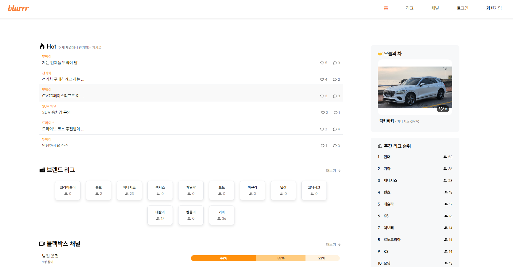
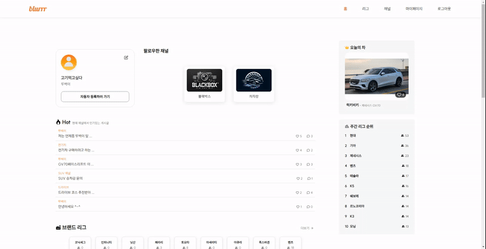
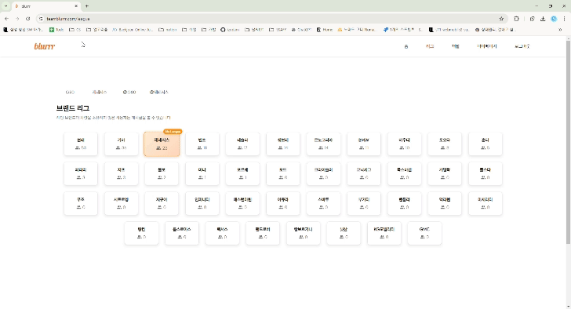
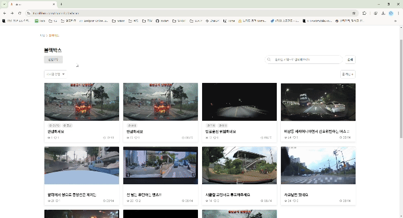

[ 삼성 청년 SW 아카데미(SSAFY) 11기 - 공통 프로젝트 ]

# 🚗Blurrr

**Blurrr 서비스**는 자동차 인증을 통해 신뢰할 수 있는 정보와 소통의 장을 제공하는 커뮤니티 플랫폼입니다.

사용자들은 자신의 자동차를 인증하고, 같은 브랜드나 모델의 자동차 소유자들과 소통하며, 다양한 주제의 채널에서 자유롭게 참여할 수 있습니다.

---

## 💻 프로젝트 주요 기능

### 🚘**자동차 인증**

- 사용자 회원가입 후, 자동차 등록증을 업로드하면 자동차의 모델과 브랜드가 매칭되어 리그를 할당받게 됩니다.
- 인증된 사용자에게는 닉네임 옆에 자동차명이 표시됩니다.

### 🏆 **리그 기능**

- 같은 브랜드 또는 모델의 자동차를 소유한 사용자들끼리 소통하는 전용 공간입니다.
- 리그 내에서 신뢰성 높은 정보를 얻고 교류할 수 있는 것이 특징입니다.

### 💬 **채널 기능**

- 자동차 소유 여부와 관계없이 다양한 주제로 참여할 수 있는 자유로운 소통 공간입니다.
- 블랙박스, 차 자랑, 전기차 등 여러 주제별 채널이 마련되어 있습니다.
- 특정 리그를 멘션하여 그 리그 사용자들과 직접 소통할 수 있는 기능을 제공합니다.

---

## 🧑🏻‍💻 팀원

### Client
|김주연|정승훈|조민주|
| :-: | :-: | :-: |
 |  |  |
|[izodam](https://github.com/izodam)|[Jeongseunghun](https://github.com/Jeongseunghun)|[mimiminz](https://github.com/mimiminz)|

### Server
|박근석|전상현|최은혜|
| :-: | :-: | :-: |
|||
[parkrootseok](https://github.com/parkrootseok)|[tkdgus97](https://github.com/tkdgus97)|[EH05](https://github.com/EH05)

## ⚒️ 기술 스택

## 🖥️ Client
|역할|종류|
|:-|:-|
|Framework|	 |
|Programming Language|  |
|Styling| |
|State Management| ||
|Version Control|	  |
|IDE|  |

## 🖥️ Server
|역할|종류|
|:-|:-|
|Framework|	 
|Programming Language| |
|Database|     |
|Cloud|   | 
|DevOps|  | | 
|Version Control|	  |
|IDE|  

## 🖥️ Data
|역할|종류|
|:-|:-|
|Framework|	 
|Programming Language| |
|Cloud|  | 
|DevOps|  | | 
|Version Control|	  |

## 🖥️ Common
|역할|종류|
|:-|:-|
|Collaboration|   |

***
